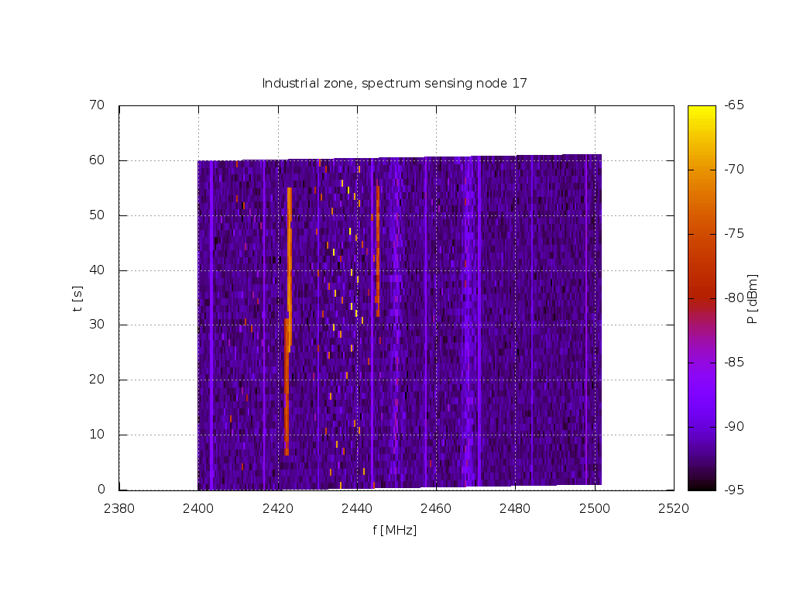

Simple cognitive radio example
==============================

LOG-a-TEC
---------

The `logatec.py` script uses one node the Campus cluster of the
LOG-a-TEC testbed to simulate a cognitive terminal. Another node is used to
simulate a legacy terminal, while two other nodes are setup as spectrum
sensors and observe the transmission.

Since the LOG-a-TEC testbed does not currently support packet based
transmissions and low-latency control of the sensor nodes, the behavior and
transmission frequencies of nodes are programmed in advance. As such this is
not a true demonstration of a cognitive radio, but rather a demonstration of how
to simulate a presence of one in the testbed.

Experiments running on LOG-a-TEC testbed are controlled over the Internet from
a Python script running on the user's computer. To run an experiment, you need
the following installed on your system:

 * Python 2.7 (usually already installed on Linux systems) and
 * a valid username and password for the LOG-a-TEC testbed saved in `.alhrc` in
   your home directory (see https://github.com/sensorlab/vesna-alh-tools for
   details).

To install required Python packages, run:

    $ pip install --user -r requirements.txt

To run the experiment:

    $ python logatec.py

The script saves the recorded spectrogram data into the `data` subdirectory. Data is written into text-based files that are simple to import into Matlab or other software. To visualize using GNU Plot, run:

    $ gnuplot -p basiccr.gnuplot

See comments in the `logatec.py` script for more details.
